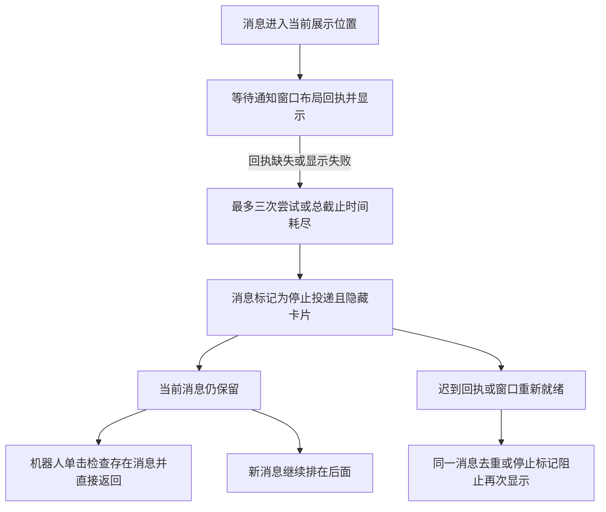

# 1.0.53 锁屏后不弹卡片、机器人点击无响应：根因调查

2026-09-22。调查基线：`65ed423b5a92642cc0242dadcdb335002284dcfd`。与 1.0.53 发布构建提交 `3c860d933dc4d4627789cb4f4f461e55c6a57e55` 比较，`src`、`src-tauri` 无差异。

用户确认版本为 1.0.53，过夜时锁屏，退出再启动后恢复。托盘菜单“应该可以”，尚非现场验证；暂未确认双击、拖动是否也失效。锁屏不能直接当作睡眠/休眠处理。

**已经确认一条能产生相同表象的程序缺陷：通知显示失败后，消息继续占用当前展示位置，同一消息无法重新显示，单击又被这条不可见消息拦住。锁屏后的实际首发故障尚未取得现场证据；不能据此断言用户机器一定发生了 WebView2 崩溃、GPU 故障或原生死锁。**

本段记录首次调查时的状态：当时未改生产逻辑。后续修复及验证工具见 [1.0.54 实施记录](20260922-runtime-recovery-implementation.md)。下列源码引用固定到调查基线，避免被后续代码改动混淆。

## 已确认的故障链

1. [notification-delivery.ts:41](https://github.com/sylarxx/DesktopPets/blob/65ed423b5a92642cc0242dadcdb335002284dcfd/src/utils/notification-delivery.ts#L41) 等待布局回执 1.5 秒，单条消息最多尝试三次，总时限 10 秒。`stop()` 将该消息的 `stopped` 设为 `true`，隐藏卡片并停止计时器。
2. [App.vue:166](https://github.com/sylarxx/DesktopPets/blob/65ed423b5a92642cc0242dadcdb335002284dcfd/src/App.vue#L166) 的失败处理只设置短气泡“提醒暂未显示，消息已保留，可在工作台查看”，没有解除当前消息对单击和后续队列的占用。
3. [MascotWindow.vue:381](https://github.com/sylarxx/DesktopPets/blob/65ed423b5a92642cc0242dadcdb335002284dcfd/src/views/MascotWindow.vue#L381) 的单击处理按 `Boolean(props.sysMessage)` 决定是否阻止输入框。消息存在就返回，没有判断这条卡片是否实际显示或已经投递失败。
4. [App.vue:481](https://github.com/sylarxx/DesktopPets/blob/65ed423b5a92642cc0242dadcdb335002284dcfd/src/App.vue#L481) 在当前消息存在时，把新消息排到后面；更新数量不会更换当前消息的 key，不能触发新一轮显示。
5. [notification-delivery.ts:105](https://github.com/sylarxx/DesktopPets/blob/65ed423b5a92642cc0242dadcdb335002284dcfd/src/utils/notification-delivery.ts#L105) 对相同 key、相同内容直接返回；同 key 内容变更在不可见时也直接返回。即使先隐藏再恢复，保存的失败标记仍阻止显示。
6. [App.vue:1137](https://github.com/sylarxx/DesktopPets/blob/65ed423b5a92642cc0242dadcdb335002284dcfd/src/App.vue#L1137) 收到通知窗口重新就绪，只调用普通同步，没有开启独立的恢复轮次。迟到回执和重新就绪都不能解除上述停止状态。

这里混淆了两个不同状态：**有一条待处理消息**和**有一张正在占用界面的卡片**。有限重试本身有必要，但“这一轮失败”不应等于“这条消息在本次进程生命周期内失去恢复资格”，也不应让单击静默失效。

还确认了另一处恢复缺口：[notification-delivery.ts:83](https://github.com/sylarxx/DesktopPets/blob/65ed423b5a92642cc0242dadcdb335002284dcfd/src/utils/notification-delivery.ts#L83) 在一次显示返回成功后保存 `visible = true`。此后正常同步只更新内容，没有检查通知窗口是否仍能接收事件、是否需要重新布局和显示。通知窗口后来失去显示能力或重建，旧的成功状态可能继续阻止重新显示。原生 `show` 成功和 DOM 有尺寸也不能证明用户实际看到了卡片。

## 锁屏如何可能触发，哪些仍需现场确认

Chromium 的 Windows 遮挡检测文档明确记载，锁屏会把窗口视为被遮挡；被遮挡时停止渲染并限制 JavaScript 调度。这说明锁屏值得独立测试，但不证明用户安装的具体 WebView2 Runtime、透明窗口和当晚状态一定走了这一分支。[Chromium 原始说明](https://chromium.googlesource.com/chromium/src/+/master/docs/windows_native_window_occlusion_tracking.md)

本地故障注入显示：消息展示开始后，如果时钟前进 60 秒而回调无法执行，恢复调度时原 10 秒截止时间已过，可能只尝试一次就进入停止状态。之后正常同步也不能恢复。这验证了代码对调度中断的处理缺陷，**不是 Windows 锁屏的实机复现**。

当前程序没有注册 `WTS_SESSION_LOCK` / `WTS_SESSION_UNLOCK`，也没有电源恢复、`visibilitychange` 或网络恢复后的集中协调流程。解锁不会主动清理过期展示、重新握手窗口、恢复投递或检查点击路径。Windows 提供了独立的锁屏/解锁通知，需要注册才能接收。[WM_WTSSESSION_CHANGE](https://learn.microsoft.com/en-us/windows/win32/termserv/wm-wtssession-change)

另一个必须保留的分支是 WebView2 渲染进程自身不响应。消息订阅、轮询、超时、会话校验和点击处理都依赖机器人 WebView 中的 JavaScript；如果这个执行环境停住，让它自己的计时器检测和修复自己是不可靠的。当前原生程序及本地 Wry 0.55.1 Windows 实现没有发现应用可用的 `ProcessFailed` / `RenderProcessUnresponsive` 恢复处理。微软建议应用处理浏览器退出、渲染进程退出和渲染进程无响应，分别选择重载或重建。[WebView2 进程故障处理](https://learn.microsoft.com/en-us/microsoft-edge/webview2/concepts/process-related-events)

三项区分边界：

| 现场现象 | 对本次结论的影响 |
| --- | --- |
| 单击无响应，双击打开工作台或拖动仍可用 | 与不可见消息阻止单击的代码缺陷相符。双击本身绕过这条单击限制。 |
| 单击、双击、拖动都失败，托盘“退出”可执行 | 应重点查机器人渲染进程、原生点击穿透状态或透明覆盖窗口；队列缺陷不能单独解释全部现象。 |
| 托盘菜单、退出也失效 | 需要抓宿主线程等待链/转储；本次没有证据把原生锁竞争定为根因。 |

**30 分钟边界也很重要。** [App.vue:497](https://github.com/sylarxx/DesktopPets/blob/65ed423b5a92642cc0242dadcdb335002284dcfd/src/App.vue#L497) 会移除过期消息。如果机器人 JavaScript 与定时器已经恢复，一条旧消息不会无限期阻止单击。如果解锁后长时间连双击、拖动都不可用，需要继续查渲染/命中路径。另一方面，已超过 30 分钟的夜间消息按现有产品规则本来就不应再弹桌面卡片；调查应使用解锁前后新产生且仍有效的消息，不能把正常过期算成丢消息。

## 为什么前两次修复没有覆盖这条链

`b7fc5bc`（1.0.45，“修复长期交互与登录状态恢复”）主要修正登录态判定，以及气泡收缩后前端未完成 IPC 时的原生位置/点击恢复，增加了 1.5 秒回退。它处理的是一次窗口切换，不是长时间锁屏后的渲染执行环境恢复。

1.0.53 处理布局回执、最多两次补救、旧请求隔离和卡片切换。原生长期可见性查询在最终实施中被撤回，见[当时实施记录:12](/Users/xyc/Documents/XYC/上海华力/桌面端--机器人/docs/implementation-20260910/实施记录.md:12)。最终代码没有后台状态恢复流程。

[现有测试:36](https://github.com/sylarxx/DesktopPets/blob/65ed423b5a92642cc0242dadcdb335002284dcfd/src/utils/notification-delivery.test.ts#L36) 还专门验证“停止后迟到回执、重复更新及其他消息不能复活它”，以防无限重试。这个局部目标成立，但缺少“窗口恢复后可开启一次新轮次”和“展示失败不阻止用户操作”的联动验收。

历史 Windows 门禁覆盖启动、点击、拖动、卡片和退出重启恢复；没有实际锁屏/解锁或渲染进程失活后的验收。退出再启动会重新创建 WebView、通知预算和连接，能恢复不代表已有原生恢复逻辑生效。

网络层也有问题，但不能直接解释全部症状：[sys-message.service.ts:403](https://github.com/sylarxx/DesktopPets/blob/65ed423b5a92642cc0242dadcdb335002284dcfd/src/services/sys-message.service.ts#L403) 和旧任务 WebSocket 会信任 `OPEN` / `CONNECTING`，没有主动健康握手。普通五分钟会话检查没有强制重连，旧任务通道也没有接收 `force` 参数。然而系统消息还有每 10 秒 HTTP 轮询兜底；在 JavaScript 正常、接口可用且有新的有效消息时，单纯 WebSocket 断开不足以解释机器人也点不动。

HTTP 已有涵盖正文读取的 12 秒超时，并保护跨会话旧结果。登录失效也有二次确认。当前没有证据把“token 过期”作为这次假死的唯一原因。

## 已执行的验证

运行 [reproduce-lock-screen-stall.mjs](/Users/xyc/Documents/XYC/上海华力/桌面端--机器人/scripts/qa/reproduce-lock-screen-stall.mjs)。脚本直接执行实际通知协调器，并从 `App.vue`、`MascotWindow.vue` 提取实际同步、队列、过期和单击函数；模拟 IPC、时钟、原生显示与响应式引用。它是记录当前缺陷的调查工具，不是要求未来保留这些行为的产品回归测试。

| 场景 | 观察结果 |
| --- | --- |
| 正常布局回执与显示，对照组 | 卡片显示；清空消息后单击可打开输入框。 |
| 缺失布局回执 | 三次后停止；卡片不可见；单击被阻止；新消息在后等待；迟到 ACK 和 ready 同步不能恢复。执行实际过期清理后单击恢复。 |
| 展示过程中调度中断 60 秒 | 一次尝试后耗尽总时间；恢复调度后仍不显示、仍阻止单击。 |
| 曾显示成功，随后注入原生显示丢失 | 正常同步及内容变化均未重新 show，逻辑仍认为卡片可见。 |
| 重新创建协调器，对照组 | 同一未读消息在新预算中可显示，与重启能恢复相容。 |

结果及源文件 SHA256：[source-probe.json](/Users/xyc/Documents/XYC/上海华力/桌面端--机器人/artifacts/lock-screen-investigation-20260922/source-probe.json)。

运行 6 个现有相关测试文件，共 29 项，全部通过：通知投递、输入框访问条件、系统消息服务、旧任务 WebSocket、会话二次确认、消息过期。该结果说明当前局部测试没有防住上述组合缺陷，不是 Windows 原生故障已经修复的证据。

## 根治应落实的改动与验收

1. **拆开消息保存与界面占用。** 保留后台未读和必要的待恢复消息；展示失败必须解除对输入框的静默限制，不得让不可见的队首无限占住后续消息。不能仅把判断替换为一个同样可能过期的 `visible` 布尔值。
2. **增加明确的恢复轮次。** 锁屏时停止消耗“用户可见展示”的预算；解锁时清理过期消息、确认窗口就绪，允许仍有效的消息进入一轮新的有限投递。新轮次由经过合并去重的解锁、窗口重建成功或用户主动恢复触发，普通重复消息和迟到回执不能重置预算。恢复失败结束当轮，不能无限重试或循环闪窗。
3. **由原生侧区分窗口和渲染器是否活着。** 注册本会话锁屏/解锁通知，辅以电源恢复；在桌面可交互时检查各窗口的事件响应，区分宿主主线程、WebView JavaScript 与显示表面，结合 WebView2 故障事件决定恢复。锁屏期间、启动宽限期和主线程忙时不能仅因前端心跳迟到就重载。
4. **保护恢复前的数据。** 重载/重建可能清空内存中的消息、任务以及组件状态。须先明确哪些状态由原生保存、哪些从后台补取，保留草稿、登录态、未读状态、原到期时间和用户主动隐藏意图；跨窗口 generation / session epoch 必须一起协调。重建成功后恢复握手，不能只刷新某个 WebView 就宣布完成。恢复不自动执行已读、完成任务或重复写请求。
5. **解锁后恢复消息连接。** 独立恢复两个消息通道并立即做有界补取，保留去重和 30 分钟到期规则。不要把 HTTP 会话校验误当成 WebView 健康检测，也不要依赖 `OPEN` 状态判断连接一直有效。
6. **留下最小现场证据。** 当前前端诊断函数是 no-op，原生 writer 也直接返回 `false`，启动会清理旧诊断日志。不能指望现有 1.0.53 自动留下完整故障链，也不能简单重新启用旧日志调用——其中有传入完整登录凭据的历史代码。新增独立、限定字段的运行状态记录，只保存锁/解锁、窗口世代、回执耗时、停止原因、进程故障类别、连接结果等，定长轮转，不记 token、回调 URL 或消息正文。

本地先为上述期望行为建立回归测试，随后在 Windows 10/11 真机验收：锁屏超过后台调度阈值后解锁、多次锁/解锁、实际过夜、新有效消息补入、已过期消息不补弹；再分别注入通知窗口回执缺失、机器人渲染器无响应和连接失效。每种场景同时验证卡片、单击、双击、拖动、托盘和草稿/任务保留。验收要确认无需退出进程即可恢复，且没有抢焦点、误清已读或恢复闪烁。

以上为调查阶段的实施要求；后续完成情况参见 1.0.54 实施记录和对应提交的验收证据。
